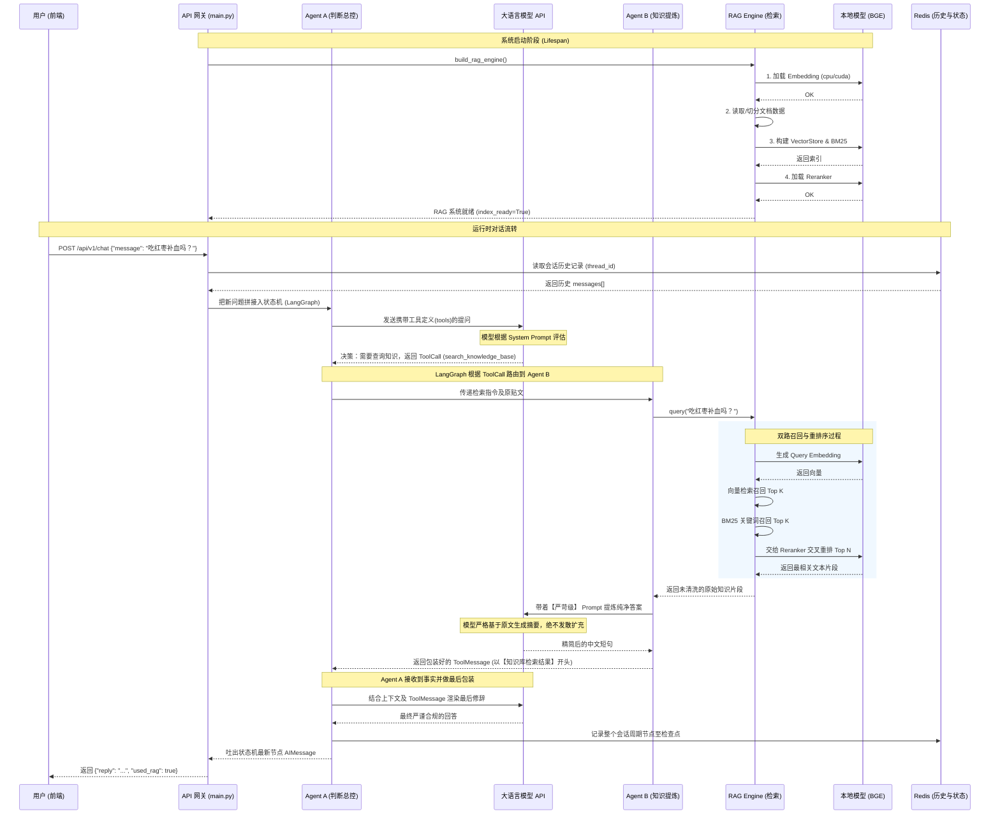

# 企业知识库专家协同系统逻辑流程图

这是一个全景展示系统请求流转、多智能体交互 (LangGraph) 以及大模型结合本地知识库(RAG)的完整泳道图/流程图。

### 流程说明摘要
1. **全局调度 (`main.py`)**：通过 FastAPI 暴露接口，并在 `lifespan` 阶段完成了耗时的 Embedding 和 Reranker 模型显存加载，保证了在有请求来临时直接推理，避免延迟陡增。
2. **多智能体博弈 (`core/agents.py`)**：
   - **Agent A (总控节点)** 负责闲聊应对和意图判断。它像人脑的高级皮层，决定是直接用自带常识说“你好”，还是触发去企业知识库查阅的工具调用动作。
   - **Agent B (检索专家)** 负责从知识库的泥沙里淘金。因为直接交给主模型的原始检索段落太杂，它充当清洗员去提纯核心重点。
3. **混合检索管道 (`core/rag_engine.py`)**: RAG 组件并没有完全依赖大模型，而是利用成熟的（向量 + BM25 双路召回）+ `bge-reranker` （交叉注意力重排）结构，保障了命中企业本地数据的召回准确率。
4. **记忆持久化 (Redis)**: LangGraph 通过 `RedisSaver` 挂载在图上，只要带有同一个 `thread_id`，上文的脉络就会自动携带进模型，实现了真正的跨端协同问答。
